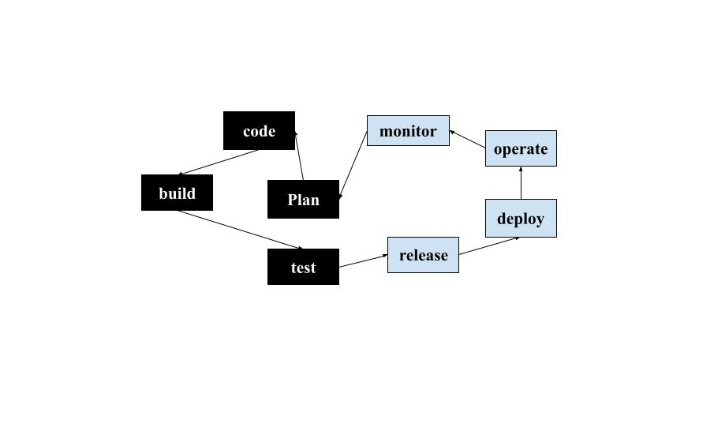
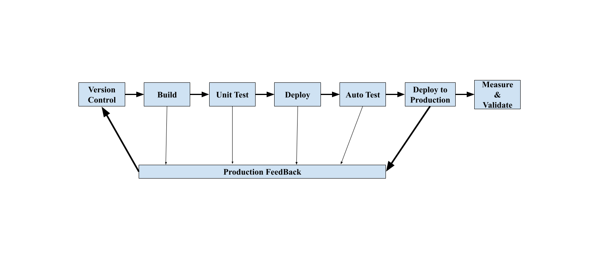
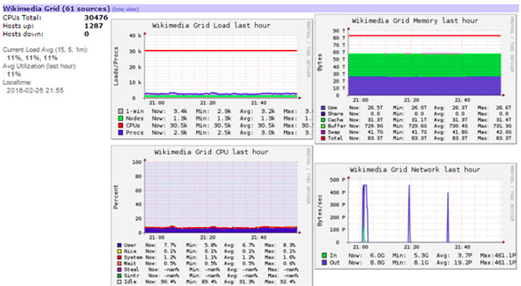

**MENGGUNAKAN OS WINDOWS dan Aplikasi VSCODE STUDIO dengan Extencion MARKDOWN ALL IN ONE**
===
**No 1**
---
*DevOps adalah serangkaian praktik yang mengotomatiskan proses antara pengembangan aplikasi dan tim pengembang agar mereka dapat melakukan proses build test dan release perangkat lunak lebih cepat dan lebih handal.*
*Seberapa penting peran DevOps dalam suatu perusahaan, Menurut saya peran DevOps dalam perusahaan sangat penting karena DevOps berperan untuk membuat alur sistem kerja yang menghubungkan antara tim Developer dan Operasional agar suatu produk dapat diselesaikan dengan tepat waktu.*
---
*Gambar Flow DEvOps :*
---

---
*=>[Sumber Jawaban](https://www.codepolitan.com/berkenalan-dengan-devops-5ab7bbe4947b4)*
===

**No 2**
---
*Beberapa perbedaan antara AWS dan OpenStack :*
---
|Layanan yang Ditawarkan|     AWS      |   OpenStack     |
|-----------------------|--------------|-----------------|
|Elastisitas       |Auto Scalling adalah bagian dari AWS|Penskalaan otomatis dengan Heat|
|Server virtual    |berdasarkan EC2|Berdasarkan Instance di Nova|
|Layanan Alur Kerja|Mengikuti Simple Workflow Service (SWF)|Ini memiliki Mistral - Layanan Alur Kerja|
|Alat Produktivitas Bisnis|Amazon WorkDocs|None|
|Manajemen Beban Kerja|ELB (Penyeimbang Beban Elastis)|Load Balancer sebagai Layanan (LBaaS)|
|Penagihan|Laporan Penggunaan dan Penagihan AWS|Ceilometer - Penagihan berbasis telemetri, pelacakan sumber daya, dll|
|Perpesanan Perusahaan|Simple Queue Service (SQS)|layanan perpesanan cloud multi-pengguna untuk Seluler dan Web|
|Layanan Pencarian|Layanan pencarian elastis|Lampu pencarian|
|Jaringan yang Dialokasikan|Koneksi langsung|Tidak Ada Jaringan Khusus|
|Database (NoSQL)|DynamoDB|Trove|
|Kerangka Tanpa Server|Lambda| No Serverless Framework|
|Penyimpanan Data SAN|EBS (Penyimpanan Blok Elastis)| Cinder|
|Cache (InMemory)|ElastiCache|Tidak Ada Dalam Cache memori|
|Penerapan proyek skrip|CodeDeploy Code Commit Code Pipeline|Tidak Ada Penerapan Aplikasi dengan Skrip|
|Dockers atau Container berbasis Microservices:|ECS (Layanan Kontainer EC2)|Magnum|
|RDB (Basis Data)| RDS| Trove|
|Administrasi Sistem Nama Domain| Route 53| Designate|
|Jaringan Pengiriman Konten (CDN)|CloudFront|Tidak Ada Jaringan Distribusi Konten|
|Template atau Gambar|AMI (Gambar Mesin Amazon)| Glance|
|Arsitektur Penyimpanan Data Cloud|S3 (Layanan Penyimpanan Sederhana)|Swift|
|Gudang Data atau Database|Redshift| Trove|
|Orkestrasi atau Penjadwal Pekerjaan| AWS Batch| Heat|
|Data Archiving|Glacier|Swift|
| Big Data|EMR (Pengurangan Peta Elastis)| Sahara|
|Identitas dan Manajemen Akses| IAM|KeyStone|
|Berbagi File Kolaborasi|EFS (Elastic File System|Manila|
|Cloud Pribadi di Cloud Publik|VPC (Virtual Private Cloud)|Neutron|
|Platform Hosting Terkelola|Elastic Beanstalk|Tidak ada Platform Hosting Terkelola|
---
*=>[Sumber Jawaban](https://www.besanttechnologies.com/aws-vs-openstack)*
===
**No 3**
---
**Tools GITLAB CI**
---
*Dari informasi yang saya baca di google kalau menggunakan tools GITLAB CI pada proses deployment,kita bisa mulai menjalankan bulid script GITLAB di komputer kita, tanpa harus menunggu GITLAB CI menjalankannya dengan berhasil atau gagal di server.*
---
*=>[Sumber Jawaban](https://software.endy.muhardin.com/devops/gitlab-ci-kubernetes-gke/)*
===
**No 4**
---
*Menurut saya kenapa proses CI/CD diperlukan, karena proses CI/CD merupakan penghubung antara tim operasional dan development dengan melakukan automasi pembangunan, testing, dan perilisan aplikasi. CI/CD juga berguna dalam membantu developer dan tester dalam melakukan rilis dan update aplikasi atau software dengan lebih cepat dan aman, terutama karena CI/CD dilakukan dalam ‘environment’ yang terstruktur.*
---
*WorkFlow CI/CD :*
---

---
*=>[Sumber Jawaban](https://www.jagoanhosting.com/blog/implementasi-ci-cd-pipeline/)
===
**No 5**
---
*SKIP*
===
**No 6**
---
**Tools Monitoring :**
---
*1.Nagios Core*
---
*Keuntungannya :
---
    *Akses multi-pengguna dan tampilan khusus pengguna dapat dikonfigurasi.
    *Core menyediakan pemantauan semua komponen infrastruktur penting.
    *Peringatan dengan kemampuan eskalasi dikirimkan ke staf TI melalui email dan SMS untuk memastikan deteksi cepat gangguan.
    *Tampilan terpusat dan tinjau informasi status terperinci melalui antarmuka web.memastikan klien melihat informasi spesifik.
    *Events handler dapat secara otomatis restart aplikasi, server, perangkat, dan layanan yang gagal ketika masalah ditemukan.
---
*2.Logic Monitor* 
---
*Keuntungannya :
---
    *Peringatan email & SMS gratis tanpa batas.
    *Remote Sessions.
    *Dashboard yang kuat menampilkan metrik kunci dalam satu layar.
    *Data tren historis yang disimpan selama 1 Tahun.
---
*3.Monitis*
---
*Keuntungannya :
---
    *Laporan real time.
    *Grafik yang interaktif.
    *Dapat memonitor secara bersama.
    *Tersedia berbagai bahasa.
---
*4.ManageEngine OpManager*
---
*Keuntungannya :
---
    *Dilengkapi alat troubleshoot server seperti Remote Process Diagnostic, Device tools, ping, trace route.
    *Dilengkapi Switch Port Mapper untuk memetakan setiap port switch.
    *NetFlow Traffic Analysis untuk menganalisa traffic melalui sample traffic (netflow).
---
*=>[sumber Jawab](https://blogs.masterweb.com/tool-monitoring-kinerja-server/)
===
**No 7**
---
*Setelah mencari informasi di google, menurut saya salah satu Tools Monitoring yang cukup untuk memonitoring server skala besar adalah GANGLIA. Karena bersifat open-source dan didesain khusus bagi sistem computing yang HIGH-PERfORMANCE, semacam cluster dan grid. Tools ini menghasilkan data analisis yang mudah untuk diukur. Ganglia memanfaatkan banyak teknologi mumpuni seperti XML untuk representasi data dan XDR untuk transportasi datanya.
---
*Gambaran Tampilan Pada Tools GANGLIA :*
---

---
*=>[Sumber Jawaban](https://www.dewaweb.com/blog/server-monitoring-tools-gratis/)
===
**No 9**
---
*SKIP*
---

